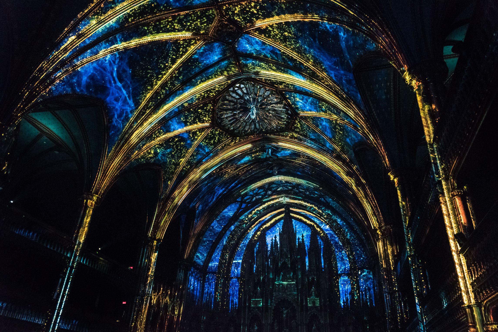
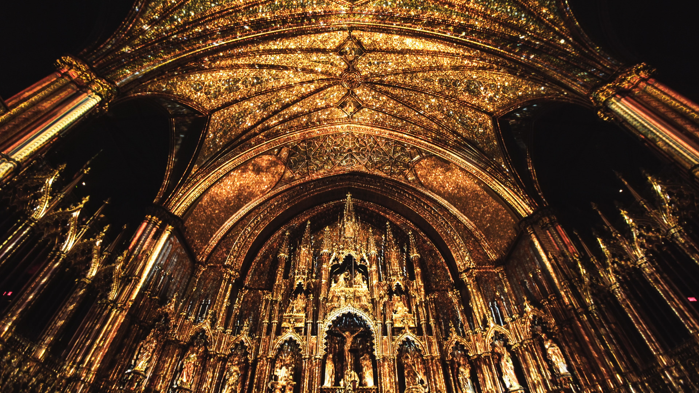

# AURA

## Informations générales de l'oeuvre
Cette œuvre peut être décrite comme "une expérience permanente en son, lumière et vidéo qui attirerait les visiteurs et leur permettrait de découvrir autrement la basilique Notre-Dame, dans le Vieux-Montréal."(comme lu sur le site de Moment Factory)
*AURA* est une création de Moment Factory, réalisée en 2017, puis revisité de début 2020 au milieu 2021, cette oeuvre est présentée à la basilique Notre-Dame, à Montréal, depuis sa création. . J'ai eu la chance de visiter cet événement le lundi 18 avril 2022.

## Description de l'oeuvre ou du dispositif multimédia

L'oeuvre est située dans la basilique Notre-Dame. Dans la basilique, lorsque l'expérience de 23 minutes commence, toutes les lumières  s'éteignent, sauf certaines lumières qui sont situées au haut de la basillique. La musique commence, puis, une lumière jaune s'allume du plafond, illuminant le devant de la salle. D'autre lumières, situées derriere les statues des membres importants de la religion catholique, qui sont à l'avant de la basilique, commencent à les illuminer en contre-jour, ce qui marque le début de la première phase. Cette expérience est séparée en 3 actes distinct: 
1. "La naissance de la lumière". Le principe de cet acte est de submerger, petit à petit, la basilique de particules scintillantes d'une couleur orangée.  Considérant que la basilique a été construite sur la hauteur, les créateurs de cette expérience multimédia ont décidé de miser sur cela en faisant monter les particules du plancher de la basilique jusqu'au plafond. Cette manière de faire "monter les particules" symbolise la montée vers ce qui est plus grand. Plusieurs particules apparaissent en même temps, au rythme de la musique, ce qui laisse penser aux visiteurs que les particules bougent au même rythme que le battement de coeur humain. Cela apporte un sentiment très humains à l'expérience, dans le but de rapprocher tout le monde et rappeler aux spectateurs que tous les humains sont semblables peu importe leur religion. Lorsque les particules atteingnent leur apogée, la basilique se remplie de lumière, puis des arbres commencent à apparaitre au plafond. La lumière comme à bouger comme si les jours passaient, et les arbres changent de couleurs, en laissant comprendre aux visiteurs que les saisons passent. Lorsque le soleil se couche, l'hiver commence et lambiance commence à changer, cela met fin à la première section.
Un exemple de l'effet du soleil qui bouge:

https://user-images.githubusercontent.com/89647613/166180652-7a6b5b49-514f-4151-91ce-6405af837738.mp4

Une vidéo qui montre le passage des saisons en accéléré:

https://user-images.githubusercontent.com/89647613/166180469-c0b35d65-032c-47af-98da-e4a47d61d4c7.mp4

3. "Les obstacles" Cette section commence lorsqu'une projection d'un déluge frappe la basilique du devant, ce qui détruit toute la lumière qui s'était créée. Les seules lumières qui restent sont celles des éclairs qui s'abattent sur les arbres. 

https://user-images.githubusercontent.com/89647613/166180694-85e200f0-5f2b-48c2-8b01-0673c443d51d.mp4

5. Plusieurs effets de vagues sont projetées, ce qui donne l'impression que tout flotte. Ensuite, lorsque l'averse se calme, une voix se fait entendre. Un amas de particules scintillantes bougent lorsque la voix chante. Cet amas essaye de "rallumer la lumière" mais elle se bat contre les obstacles symbolisés par la couleur bleu qui rappelle l'hiver, les averses, les éclairs bleu et le déluge, ouis lorsque la lumierre réussit enfin à illuminer toute la basilique, la hauteur des notes de musique commence à baisser et il y a un fade-out, puis tout devient noir.
6. "À ciel ouvert" Lorsque tout devient noir, des lasers placés derriere la basilique commencent à illuminer la salle, ils sont peu nombreux et bougent très lentement. Une musique "techno" commence à se faire entendre. L'ambiance moderne de cette partie contraste totalement avec l'ambiance plus classique et sacrée. Puis, plusieurs lasers placés devant la salle commencent à se décuplent et et illuminent toute la salle de haut en bas (les lasers vont jusqu'en haut de notre tête pour pas nous aveugler, puis recommencent tout en haut). Puis, il y a de plus en plus de lasers et ils commencent à bouger dans des patterns differents, pendant ce temps la musique devient de plus en plus forte et la hauteur des notes recommence à monter. Ensuite, lorsque la musique commence à être forte, tout s'éteint encore et les lumières font un effet de "bug". Plusieurs parties de la salle commencent à s'allumer pour une courte durée au rythme de la musique qui n'est plus que des sons. Puis, la musique recommence et elle est très dramatique, les parties de la salle s'allument de plus en plus longtemps comme si les lumières "redémarraient" mais quelle avaient de la difficulté à rester allumées. La musique s'accélère de plus en plus et les voix recommencent à chanter, et elles chantent de plus en plus aigûe, ce qui annonce aux spectateurs que l'apogée de l'expérience approche. Les deux autres sections avaient des couleurs qui les représentaient, mais cette section utiliser toutes les couleurs en même temps pour arriver à rallumer la lumière toutes ensemble. Cette section utilise aussi l'effet de "battement du coeur" qui était utilisée au premier acte. 

https://user-images.githubusercontent.com/89647613/166180864-9f81d1fd-dff2-4379-8e1e-2951cc20c4ca.mp4

Lorsque la lumière réussit afin à se rallumer, toutes les couleurs se rassemblent pour donner un jaune pâle qui ressemble à la lumière du jour, puis tout se referme pour un court moment. Ensuite, le toit commence à s'ouvrir comme si une toile prenait en feu à partir du toit et laissait révéler le ciel qui était là depuis le début, ce qui marque l'apogée de l'oeuvre. Puis, il y a un rappel de la deuxieme partie en utilisant la couleur bleu, et ensuite un rappel de la première partie en utilisant des feuilles oranges et tout se transforme en particules scintillantes et disparait, c'est la fin.

## Explications sur la mise en espace de l'oeuvre ou du dispositif 
Habituellement, les projections vidéos se font sur des fond foncés et plats, mais ce n'est pas le cas pour la basilique Notre-Dame oû l'architecture est très complexe. À cause de cette complexité, l'oeuvre nécessite de nombreux projecteurs afin de projeter les differentes parties de l'exposiiton. Il fallait aussi plusieurs lumières synchronisées avec les projections. Elles sont principalement placés sur les étages supérieurs de la basilique pour que les visiteurs ne puissent pas les voirs de leur place, ainsi qu'en haut des statue qui se trouvent au devant de la salle. Considérant que la musique ne vient pas d'une direction en particulier, je crois qu'il y avait plusieurs haut-parleurs mais je n'ai pas reussi à les trouver, car tout l'équipement est caché. Pour les lasers, il y en avait 3 en avant de la salle et un gros derriere les spectateurs en hauteur.
## Mon ressentie
### Description de mon expérience de l'oeuvre ou du dispositif
J'étais vraiment intéressée par l'oeuvre avant de l'expérimenter, car j'aime beaucoup la musique sacrée et j'ai été très heureuse d'entendre la traque sonore. On dirait vraiment que les lumières et la musique se parlent. Moment Factory a décidé de revisiter l'oeuvre afin d'ajouter l'orgue de la basilique à la musique et je trouve que c'est une bonne idée considerant que l'orgue est l'instrument le plus associé à la musique sacrée. Je n'avais vécu une oeuvre de Moment Factory et c'était vraiment impressionant, j'étais vraiment étonnée de voir tout ce qui était possible de faire avec la projection.
### Ce qui m'a plu, m'a donné des idées
J'ai vraiment aimé les differentes manières qu'ils ont utilisé pour faire "respirer" l'oeuvre, par exemple en écairant plus lorsque la musique arrive sur un temps fort ou en faisant un effet de décalage avec la projection. J'ai aussi aimé à quel point les petits détails étaient réalistes.

### Aspect que je ne souhaiterais pas retenir pour mes propres créations ou que je ferais autrement

Autant que je trouve que les petits détails étaient très réalistes et immersifs, lorsque de gros éléments étaitn projetés au plafond, comme les feuilles ou encore l'averse et le déluge, c'était difficile d'y croire, car la qualité baissait et les contours des objets devenaient un peu pixelisés et moins pigmentés. Si je devais faire une oeuvre semblable, j'essayerais de rester dans l'abstrait.

## Références
https://youtu.be/FqM0eH8usos
https://momentfactory.com/projets/tous/tous/aura
