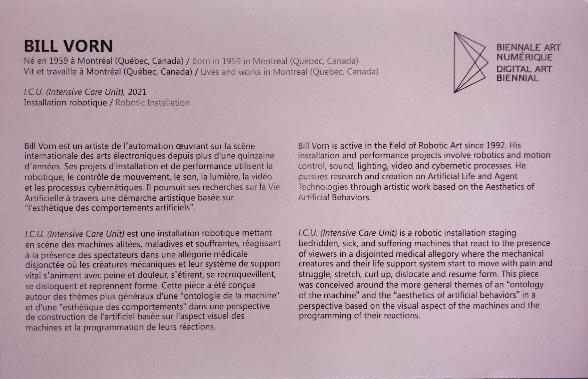
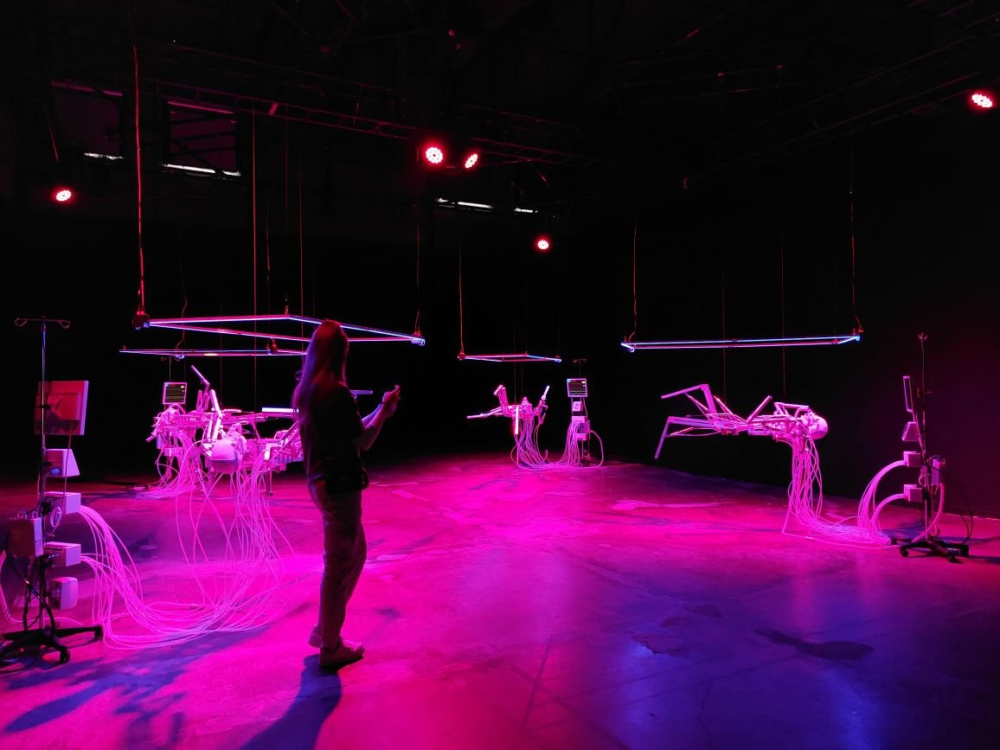
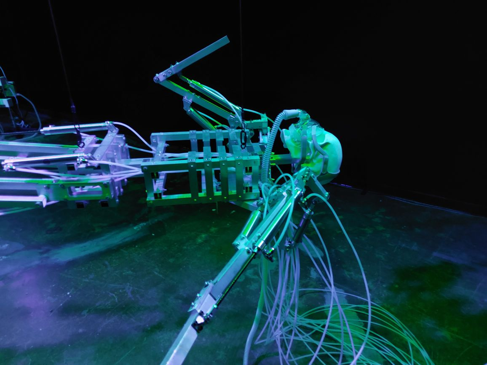
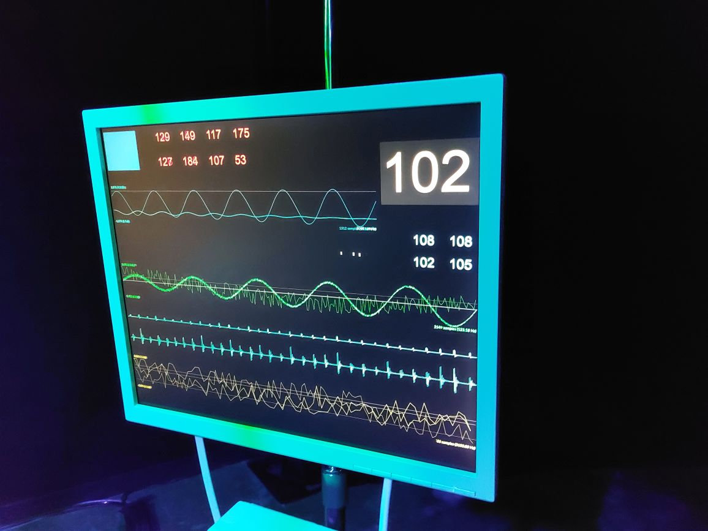
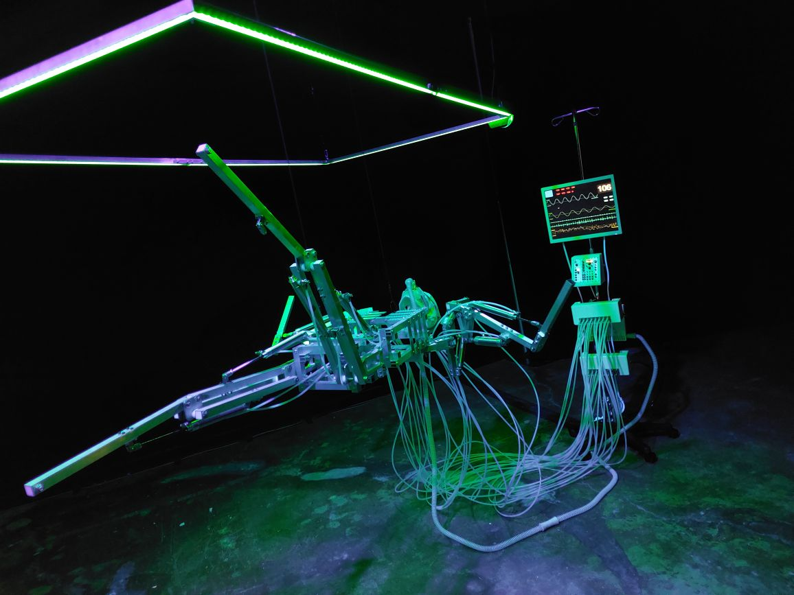
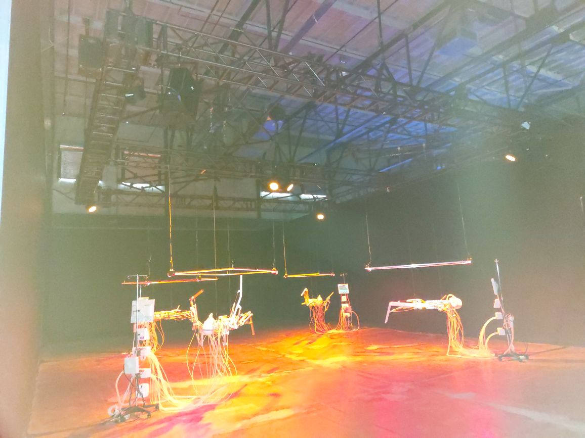

# I.C.U (INTENSIVE CARE UNIT)

## Informations générales de l'oeuvre
Cette oeuvre peut être décrite comme une "une installation robotique mettant en scène des machines alitées, maladives et souffrantes, réagissant à la présence des spectateurs"(comme lu sur le cartel d'information)

*I.C.U* est une création de Bill Vorn, réalisée en 2021, puis présentée du 19 novembre 2021 au 13 février 2022 à la Biennale internationale des arts numériques BIAN 2021 à Montréal (selon le [site de l'artiste](https://billvorn.concordia.ca/menuallF.html) consulté à la date du 23 février). J'ai eu la chance de visiter cet evenement lors d'une sortie de ma classe de *Documentation d'une collection multimedias* le jeudi 10 février 2022.

## Description de l'oeuvre ou du dispositif multimédia

L'oeuvre est dans une piece noire. Dans la piece, il y a 4 dispositifs identiques. Chaque dispositif est composé de 4 elements: 
1. Un robot-squelette composé de rectangles métaliques et un crâne en materiaux ressemblant à un os. Il y a un respirateur attaché au crâne et plusieurs autres fils qui le joignent au cardioscope 
2. Un écran d'ordinateur qui montre un cardioscope.  ainsi que l'appareil auquel les fils du robot se rattachent 
3. un rectangle lumineux à environ un mètre au dessus du squelette qui illumine l'installation 
4. 8 lumieres qui pointent vers les differents dispositifs 

## Explications sur la mise en espace de l'oeuvre ou du dispositif 

## Liste des composantes et techniques de l'oeuvre ou du dispositif 
- #
- #
- #
- #
- #

## Liste des éléments nécessaires pour la mise en exposition 
- #
- #
- #
- #
- #

## Expérience vécue

### Description de mon expérience de l'oeuvre ou du dispositif

### Ce qui m'a plu, m'a donné des idées

### Aspect que je ne souhaiterais pas retenir pour mes propres créations ou que je ferais autrement

## Références

