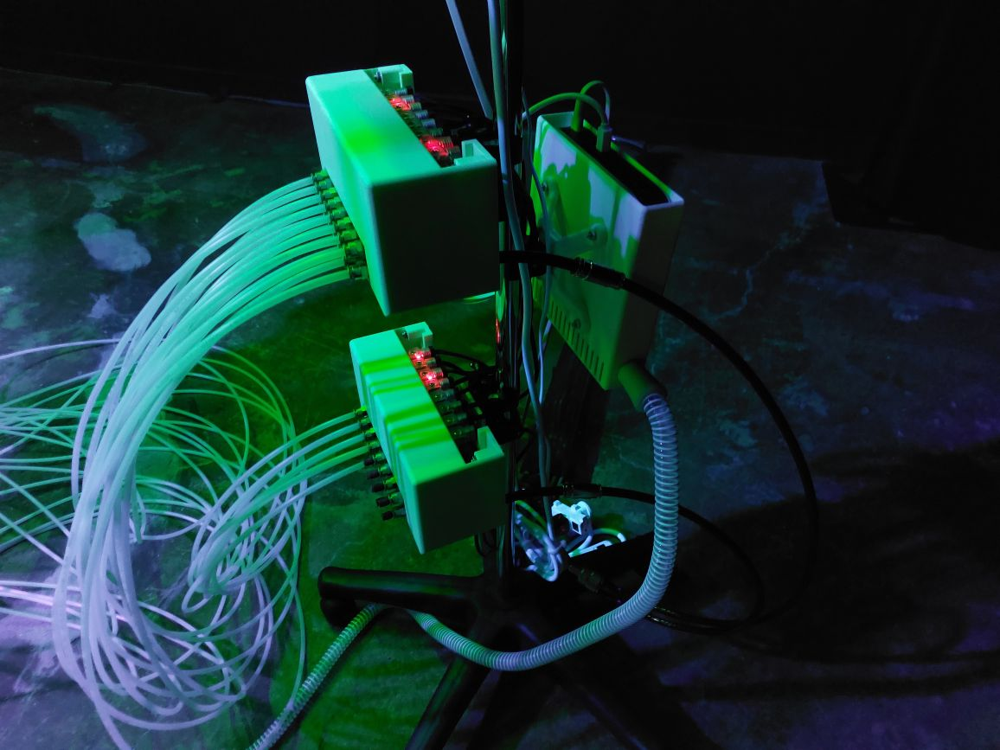

# I.C.U (INTENSIVE CARE UNIT)

## Informations générales de l'oeuvre
Cette oeuvre peut être décrite comme une "une installation robotique mettant en scène des machines alitées, maladives et souffrantes, réagissant à la présence des spectateurs"(comme lu sur le cartel d'information)

*I.C.U* est une création de Bill Vorn, réalisée en 2021, puis présentée du 19 novembre 2021 au 13 février 2022 à la Biennale internationale des arts numériques BIAN 2021 à Montréal (selon le [site de l'artiste](https://billvorn.concordia.ca/menuallF.html) consulté à la date du 23 février). J'ai eu la chance de visiter cet evenement lors d'une sortie de ma classe de *Documentation d'une collection multimedias* le jeudi 10 février 2022.

## Description de l'oeuvre ou du dispositif multimédia

L'oeuvre est dans une piece noire. Dans la piece, il y a 4 dispositifs identiques. Chaque dispositif est composé de 4 elements: 
1. Un robot-squelette composé de rectangles métaliques et un crâne en materiaux ressemblant à un os. Il y a un respirateur attaché au crâne et plusieurs autres fils qui le joignent au cardioscope 
2. Un écran d'ordinateur qui montre un cardioscope.  ainsi que l'appareil auquel les fils du robot se rattachent 
3. un rectangle lumineux à environ un mètre au dessus du squelette qui illumine l'installation 
4. 8 lumieres qui pointent vers les differents dispositifs 
Le principe de cette installation est plutôt simple. En effet, lorsqu'un visiteur s'approche d'une installation, elle est supposée s'activer. Lorsqu'elle s'active, elle nous montre la souffrance du robot malade en faisant bouger le robot comme un humain qui se débat. Malheureusement, les responsables de l'installation n'ont pas réussi à rendre l'installation interactive, ce qui veut dire que l'oeuvre est constamment activiée.

## Explications sur la mise en espace de l'oeuvre ou du dispositif 
Les robots bougent grâce à des compresseurs d'air activés au préalable. Un ordi, câché par un rideau noir, sert à activer les lumieres et certains autres aspects, alors, pour les cacher, des caches-fils sont utilisés.   Un autre ordinateur est caché dans un dispositif ressemblant à un engin médical, afin que les visiteurs n'y voient que du feu (la partie à droite est un ordinateur qui permet à l'écran médical de s'afficher)  Pour soutenir tous ces elements qui sont en hauteur, des cables de soutient sont utilisés  Ces câbles de soutient sont eux mêmes accrochés à des herses. Les photos ne sont pas clairs, car une des particularité de l'evenement est de garder l'espace sombre, alors j'ai redessiné la maniere dont les dispositifs sont accrochés aux herses dans un croquis  Le fil brun représente les differentes herses et les points rouges representent les points de rattachement. chaque dispositif est attaché à un rectangle de metal avec un trait au milieu qui est lui même vissé sur les herses. Il y a plusieurs points de rattachement afin que l'oeuvre puisse être stable. Les lumieres sont aussi rattachées à ces herses.

### Description de mon expérience de l'oeuvre ou du dispositif
Comme quelques autres visiteurs que j'ai pu voir, j'ai été vraiment surprise par cette oeuvre. Les robots ont tous l'air de bouger à leur rythme, sans se soucier de ce qui les entoure. J'avais constamment peur qu'un robot me donne un coup au visage. Après avoir lu le cartel d'information, je me sentais mal d'être aussi fascinée par l'oeuvre, car j'avais l'impression de leur causer leur souffrance. Pourtant, la lumiere est les mouvements des robots me donnaient envie de rester. Aussi, j'avais l'impression que l'air compressé qui bougeait ressemblait à des souffles étouffés, ce qui rendait l'oeuvre plus immersive à mon avis.

### Ce qui m'a plu, m'a donné des idées
J'ai vraiment aimé la maniere dont ils ont caché l'ordinateur médical, on ne pouvait pas le remarquer si on ne cherchait pas, car il faisait partie intégrale de l'oeuvre. Un autre élément que j'ai aimé est la maniere dont les bruits mécaniques de robots sont utilisés pour nous faire penser à des bruits humains remplies d'emotions. Le dernier élément qui m'a donné des idées est le concept de la curiosité morbide. Je n'aurais jamais cru qu'on pouvait aborder ce concept sans que ça tombe dans le mauvais goût, mais l'utilisaiton des robots nous le permet. J'aime vraiment l'idée d'utiliser une des facettes de l'être humain qui est d'être attirée par le malheur des autres.

### Aspect que je ne souhaiterais pas retenir pour mes propres créations ou que je ferais autrement

J'aime beaucoup cette oeuvres, mais je n'aurais peut-être pas fait une oeuvre qui a l'air si dangereuse. J'aime beaucoup me rapprocher des oeuvres pour les observer de près, mais avec elle j'avais peur que le robot me donne un coup. Si ça avait été moi, j'aurais mis des moments de pause où le robot ne bouge pas. Ces moments de pause seraient evident pour le visiteur, par exemple grâce à un effet sonore ou une lumiere qui demarquerait le début et la fin de cette pause. Comme ça on peut voir les robots bouger et on peut les regarder de plus près quand ils sont en pause.

## Références
https://billvorn.concordia.ca/menuallF.html
