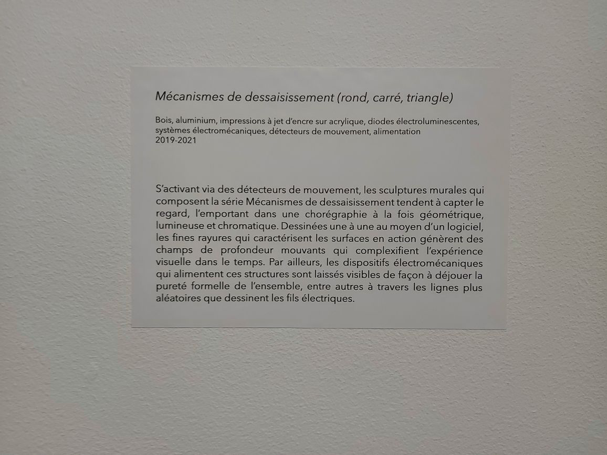
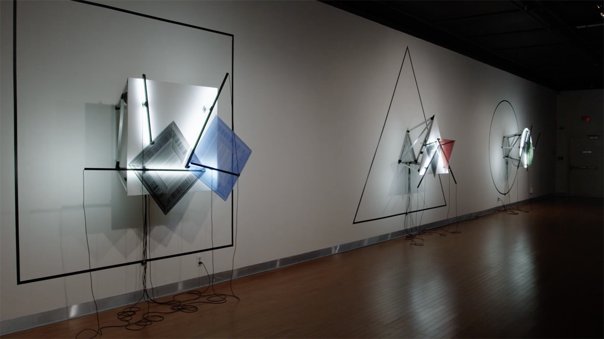
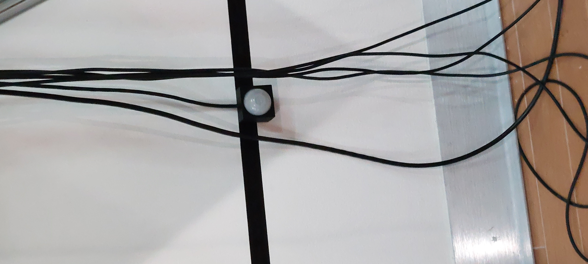
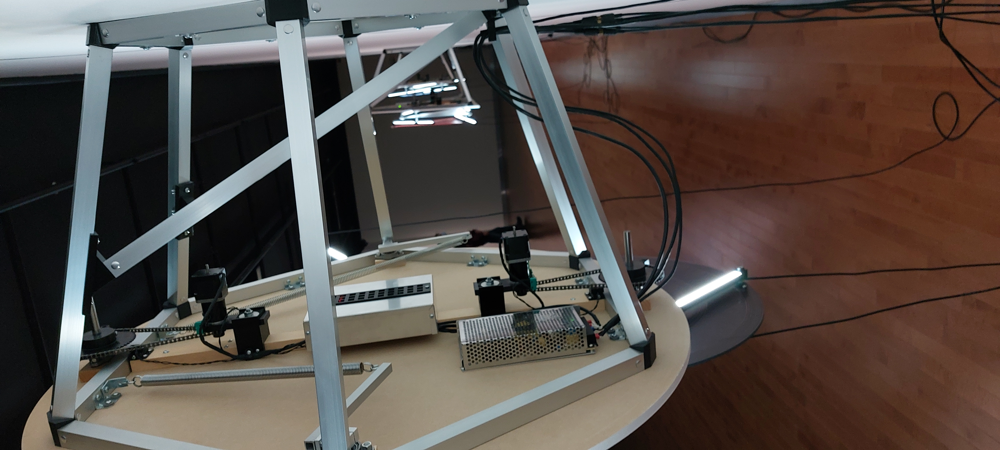

# Mécanismes de dessaisissement (rond, carré, triangle)

## Informations générales de l'oeuvre
Cette œuvre peut être décrite comme des "sculptures murales qui tendent à capter le regard, l'emportant dans une chorégraphie à la fois géométrique, lumineuse et chromatique"(comme lu sur le cartel d'information).

*Mécanismes de dessaisissement (rond,carré,triangle)* est une création du duo Bill Béchard Huon, réalisée de 2019 à 2021, puis présentée du 20 février au 16 avril 2022 à la salle Alfred-Pellan à Laval (selon le [site de la ville de Laval](laval.ca/Pages/Fr/Calendrier/mda-vernissage-bechard-hudon.aspx) consulté à la date du 28 avril 2022). J'ai eu la chance de visiter cet événement lors d'une sortie scolaire de ma classe de *Documentation d'une collection multimédia* le jeudi 17 mars 2022.

## Description de l'oeuvre ou du dispositif multimédia

L'œuvre est composé de 3 dispositif basés chacun sur une forme géométrique differente. Chaque dispositif contient: 
1. Deux formes principales en acrylique, une noire et une colorée. Des lignes sont imprimées sur ces formes grâce à l'impression à jet d’encre sur acrylique.
2. Quatre bras noir d'aluminium qui sont reliés aux deux formes principales et qui permettent de les bouger. Sur les bras, il y a des diodes électroluminescentes dirigées vers les formes princiaples afin de les illuminer.
3. Du bois blanc dont la forme correspond à la forme géométrique du dispositif dégagé du mur grâce à un support d'aluminium qui est lui aussi de la forme géométrique du dispositif.
4. Du vinyl auto-collant noir sur le mur dont la forme correspond à la forme géométrique du dispositif.
5. Un détecteur de mouvement placé au milieu du vinyl du côté du bas. 

Le principe de cette installation est plutôt simple. En effet, lorsqu'un visiteur s'approche d'une installation, elle se met en marche. Chaque dispositif bouge à une vitesse differente. Le rond bouge très lentement, le triangle un peu moins et le carré est presque vite. Les bras d'aluminium bougent dans le même pattern en boucle et chaque dispositif a son propre patern de défini.

## Explications sur la mise en espace de l'oeuvre ou du dispositif 
Les dispositifs s'activent et s'éteignent grâce à un bouton dissimulé derriere l'oeuvre. L'alimentation est branchée directement sur le mur sur lequel sont disposés les dispositifs. Aucun fils n'est caché. Les concepteurs ont aussi choisi de laisser les dispositifs électromécaniques à la vu des visiteurs, ce qui permet aux visiteurs de voir autant le côté pur et organisé de l'oeuvre que le côté plus technique et désordonné. Le support d'alumium qui soutient les dispositifs fait partie des dispositifs alors il n'a qu'à être fixé au mur afin de fonctionner, l'oeuvre n'a pas besoin de quoique ce soit de l'exposant afin d'être en place, à part le vinyl auto-collant qui doit être collé par les techniciens sur place.

### Description de mon expérience de l'oeuvre ou du dispositif
Lorsque je suis rentrée dans la salle, je ne comprenais pas vraiment l'interet de cette oeuvre, puis en la regardant longuement afin de comprendre quel était son but j'ai observé l'effet d'obtique des lignes de jet d'encres et cela m'a vraiment impressionné. J'ai aimé le fait que ça m'a permis de prendre une pause et de juste rester debout à regarder un dispositif en mouvement même s'il est vraiment lent. Ça m'a vraiment interessé qu'ils aient réussi à garder mon attention pendant aussi longtemps alors que d'habitude les oeuvres très lentes me désinteressent rapidement, mais cette oeuvre a réussi à trouver une manière de se faire aimer par les personnes avec une capacité d'attention réduite en misant sur les effets d'optiques.

### Ce qui m'a plu, m'a donné des idées
J'ai vraiment aimé l'idée de montrer des mouvements très rapides à l'aide du mouvement très lent, l'idée me fait penser à l'illusion de l'oiseau https://youtube.com/clip/UgkxvHOyGCKm3JD_mJbQB6-9YdzwHyvXKLgo qui m'a vraiment interessé quand je l'ai vu. Les differentes formes géométriques et vitesses nous laisse vraiment apprecier plusieurs variations de ce phénomène.

### Aspect que je ne souhaiterais pas retenir pour mes propres créations ou que je ferais autrement
Je n'aime pas vraiment l'idée du silence lorsqu'il y a plusieurs oeuvres autour, car il n'y aura jamais de silence, alors on dirait juste qu'il "manque" quelque chose. Pour mes propres créations, j'aimerais soit faire des oeuvres sur le silence dans une pièce dédiée au silence, ou soit faire des oeuvres qui ne sont pas basés sur le concept du silene si je sais que la salle sera bruyante à cause des autres oeuvres. Aussi, j'ai trouvé que le rond était un peu trop lent, il fallait attendre longtemps avant que les deux formes se mettent une par dessus l'autre afin qu'on puisse voir l'effet d'optique. L'oeuvre est vraiment interessante, mais je ne pense pas qu'attendre 5 minutes devant une oeuvre pour pouvoir l'apprécier pleinement offre une experience épanouissante pour les visiteurs. Finalement, je trouvais aussi que le cartel était difficile à voir lorsqu'on ne le cherchait pas.

## Références
https://www.laval.ca/Pages/Fr/Calendrier/mda-expo-bechard-hudon.aspx
https://youtu.be/dn0CTaamyKU - pour la photo de vue d'ensemble de l'oeuvre.
