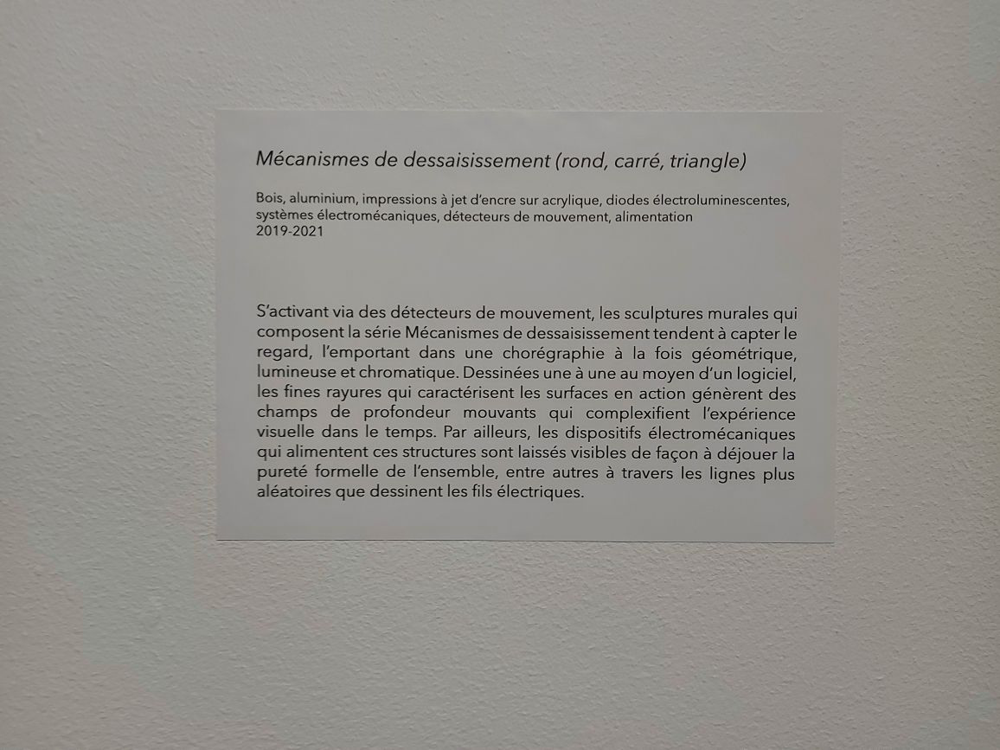

# Mécanismes de dessaisissement (rond, carré, triangle)

## Informations générales de l'oeuvre
Cette œuvre peut être décrite comme des "sculptures murales qui tendent à capter le regard, l'emportant dans une chorégraphie à la fois géométrique, lumineuse et chromatique"(comme lu sur le cartel d'information).

*Mécanismes de dessaisissement (rond,carré,triangle)* est une création du duo Bill Béchard Huon, réalisée de 2019 à 2021, puis présentée du 20 février au 16 avril 2022 à la salle Alfred-Pellan à Laval (selon le [site de la ville de Laval](laval.ca/Pages/Fr/Calendrier/mda-vernissage-bechard-hudon.aspx) consulté à la date du 28 avril 2022). J'ai eu la chance de visiter cet événement lors d'une sortie scolaire de ma classe de *Documentation d'une collection multimédia* le jeudi 17 mars 2022.

## Description de l'oeuvre ou du dispositif multimédia

L'œuvre est dans une pièce noire. Dans la pièce, il y a 4 dispositifs identiques. Chaque dispositif est composé de 4 éléments: 
1. Un robot-squelette composé de rectangles métalliques et un crâne en matériaux ressemblant à un os. Il y a un respirateur attaché au crâne et plusieurs autres fils qui le joignent au cardioscope 
2. Un écran d'ordinateur qui montre un cardioscope.  ainsi que l'appareil auquel les fils du robot se rattachent 
3. un rectangle lumineux à environ un mètre au-dessus du squelette qui illumine l'installation 
4. 8 lumières qui pointent vers les différents dispositifs 
Le principe de cette installation est plutôt simple. En effet, lorsqu'un visiteur s'approche d'une installation, elle est supposée s'activer. Lorsqu'elle s'active, elle nous montre la souffrance du robot malade en faisant bouger le robot comme un humain qui se débat. Malheureusement, les responsables de l'installation n'ont pas réussi à rendre l'installation interactive, ce qui veut dire que l'œuvre est constamment activée.

## Explications sur la mise en espace de l'oeuvre ou du dispositif 
Les robots bougent grâce à des compresseurs d'air activés au préalable. Un ordi, caché par un rideau noir, sert à activer les lumières et certains autres aspects, alors, pour les cacher, des cache-fils sont utilisés.   Un autre ordinateur est caché dans un dispositif ressemblant à un engin médical, afin que les visiteurs n'y voient que du feu (la partie à droite est un ordinateur qui permet à l'écran médical de s'afficher)  Pour soutenir tous ces éléments qui sont en hauteur, des câbles de soutient sont utilisés  Ces câbles de soutient sont eux-mêmes accrochés à des herses. Les photos ne sont pas claires, car une des particularités de l'événement est de garder l'espace sombre, alors j'ai redessiné la manière dont les dispositifs sont accrochés aux herses dans un croquis  Le fil brun représente les différentes herses et les points rouges représentent les points de rattachement. Chaque dispositif est attaché à un rectangle de métal avec un trait au milieu qui est lui-même vissé sur les herses. Il y a plusieurs points de rattachement afin que l'œuvre puisse être stable. Les lumières sont aussi rattachées à ces herses.

### Description de mon expérience de l'oeuvre ou du dispositif
Comme quelques autres visiteurs que j'ai pu voir, j'ai été vraiment surprise par cette œuvre. Les robots ont tous l'air de bouger à leur rythme, sans se soucier de ce qui les entoure. J'avais constamment peur qu'un robot me donne un coup au visage. Après avoir lu le cartel d'information, je me sentais mal d'être aussi fascinée par l'œuvre, car j'avais l'impression de leur causer leur souffrance. Pourtant, la lumière est les mouvements des robots me donnaient envie de rester. Aussi, j'avais l'impression que l'air compressé qui bougeait ressemblait à des souffles étouffés, ce qui rendait l'œuvre plus immersive et anxiogène. J'avais l'impression de manquer d'air avec eux.

### Ce qui m'a plu, m'a donné des idées
J'ai vraiment aimé la manière dont ils ont caché l'ordinateur médical, on ne pouvait pas le remarquer si on ne cherchait pas, car il faisait partie intégrale de l'œuvre. Un autre élément que j'ai aimé est la manière dont les bruits mécaniques de robots sont utilisés pour nous faire penser à des bruits humains remplis d'émotions. Le dernier élément qui m'a donné des idées est le concept de la curiosité morbide. Je n'aurais jamais cru qu'on pouvait aborder ce concept sans que ça tombe dans le mauvais goût, mais l'utilisation des robots nous le permet. J'aime vraiment l'idée d'utiliser une des facettes de l'être humain qui est dans ce cas d'être attirée par le malheur des autres.

### Aspect que je ne souhaiterais pas retenir pour mes propres créations ou que je ferais autrement

J'aime beaucoup cette œuvre, mais je n'aurais peut-être pas fait une œuvre qui a l'air si dangereuse. J'aime beaucoup me rapprocher des œuvres pour les observer de près, mais avec elle j'avais peur que le robot me donne un coup. Si ça avait été moi, j'aurais mis des moments de pause où le robot ne bouge pas. Ces moments de pause seraient évidents pour le visiteur, par exemple grâce à un effet sonore ou une lumière qui démarquerait le début et la fin de cette pause. Comme ça on peut voir les robots bouger et l’on peut les regarder de plus près quand ils sont en pause.

## Références
https://billvorn.concordia.ca/menuallF.html
